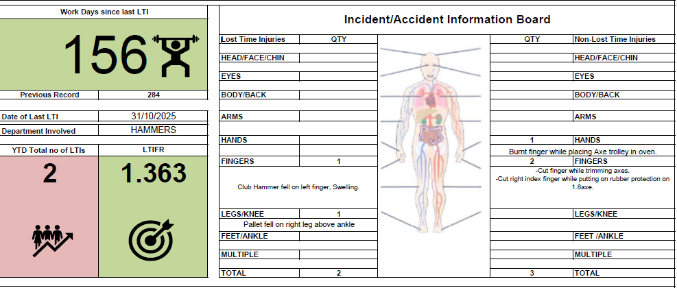
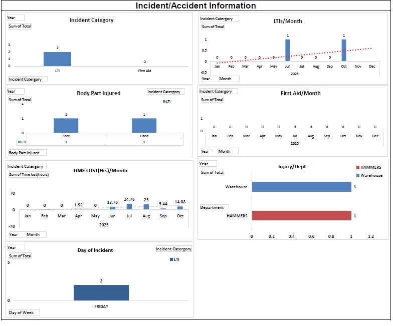
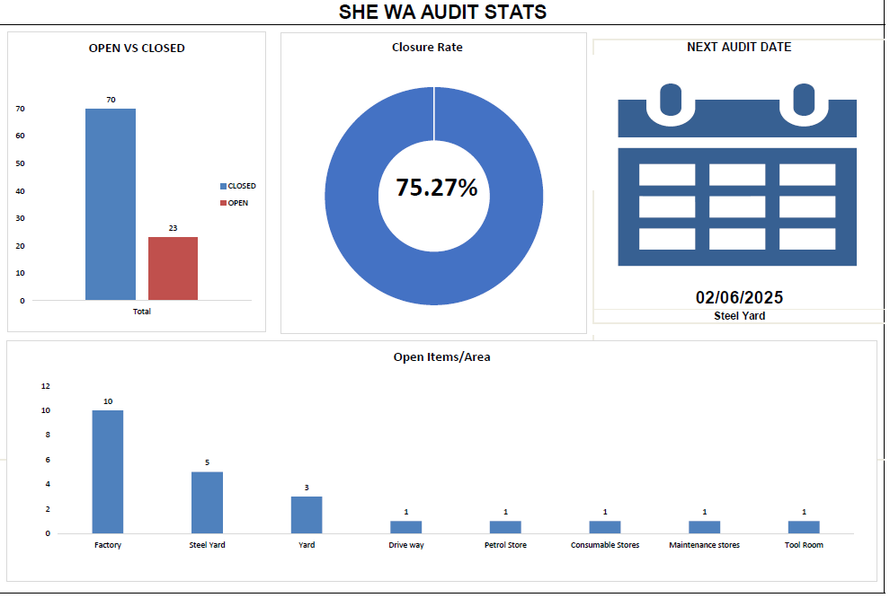
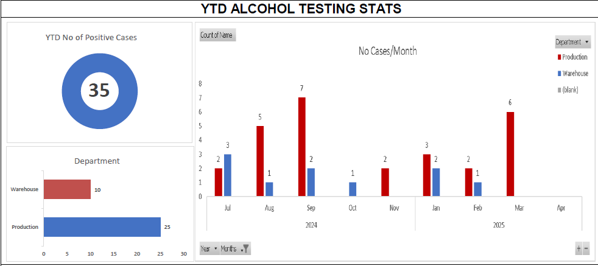
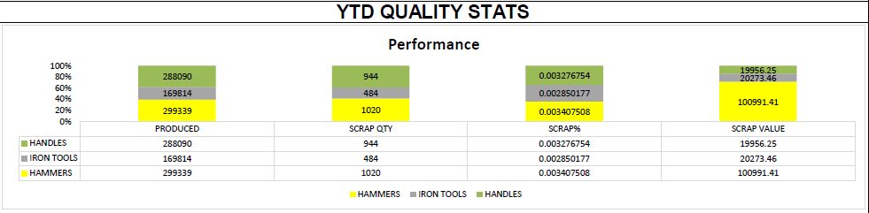
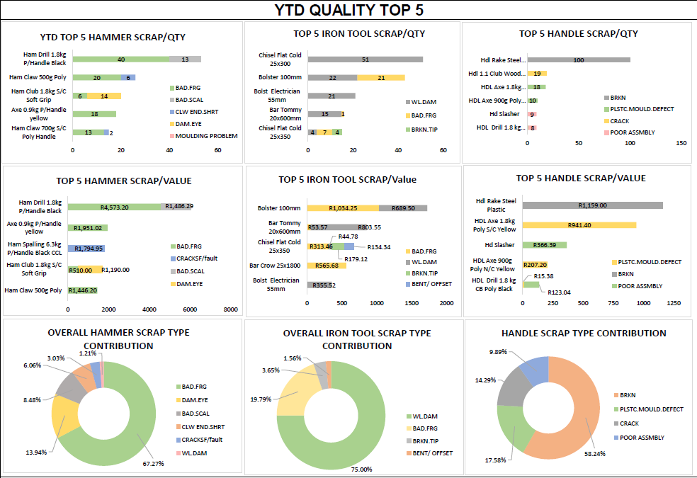
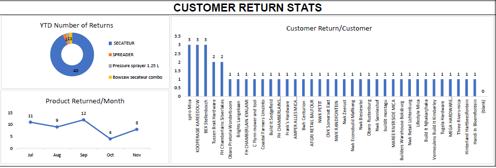

# SHEQ Dashboard - Microsoft Excel

## Dashboard Overview


This Excel-based SHEQ Dashboard provides management with visibility into Safety, Health, Environment and Quality performance across the organization.

---

## Safety Information Dashboard



Tracks:
- Lost Time Injuries (LTI)
- LTIFR
- Days Since Last LTI
- Injury Categories
- Department Incidents

---

## Safety Incident Dashboard

 

Tracks:
- Incident Trends
- Injury Types
- Monthly Incident Statistics
- Time Lost Analysis

---

## Safety Audit Dashboard



Tracks:
- Audit Findings
- Open vs Closed Actions
- Closure Rates
- Audit Performance

---

## Alcohol Testing Dashboard



Tracks:
- Positive Cases
- Department Statistics
- Alcohol Testing Trends

---

## Quality Dashboard



Tracks:
- Product Quality Performance
- Customer Returns
- Quality KPIs

---

## Top 5 Quality Issues Dashboard



Tracks:
- Top Returned Products
- Top Scrap Contributors
- Product Performance Analysis

---

## Customer Complaints Dashboard



Tracks:
- Customer Complaints
- Return Trends
- Customer-Specific Quality Issues

---

## Tools Used

- Microsoft Excel
- Pivot Tables
- Pivot Charts
- Slicers
- Conditional Formatting
- Data Analysis

---

## Repository Structure

```text
sheq-dashboard-excel/
│
├── README.md
├── dashboard/
│   └── SHEQ_Dashboard.xlsx
│
├── images/
│   ├── dashboard_overview.png
│   ├── safety_info_dashboard.png
│   ├── safety_incident_info_dashboard.png
│   ├── safety_Audit_dashboard.png
│   ├── safety_alcohol_dashboard.png
│   ├── quality_dashboard.png
│   ├── quality_top_5_dashboard.png
│   └── quality_customer_complaints_dashboard.png
│
└── data/
```
